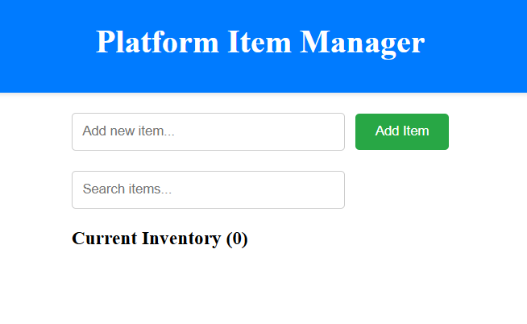
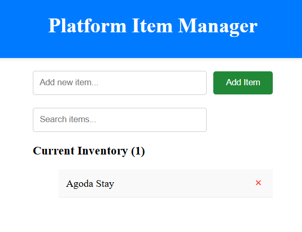
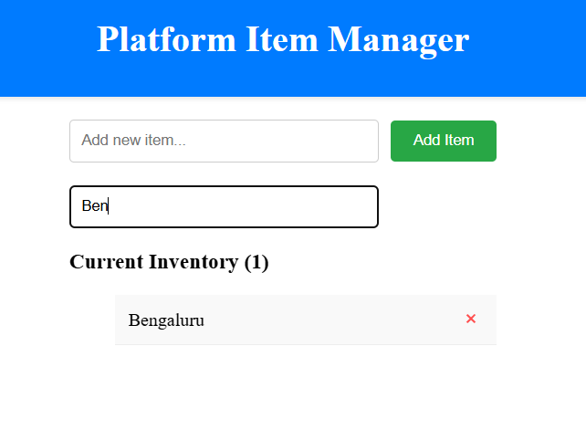
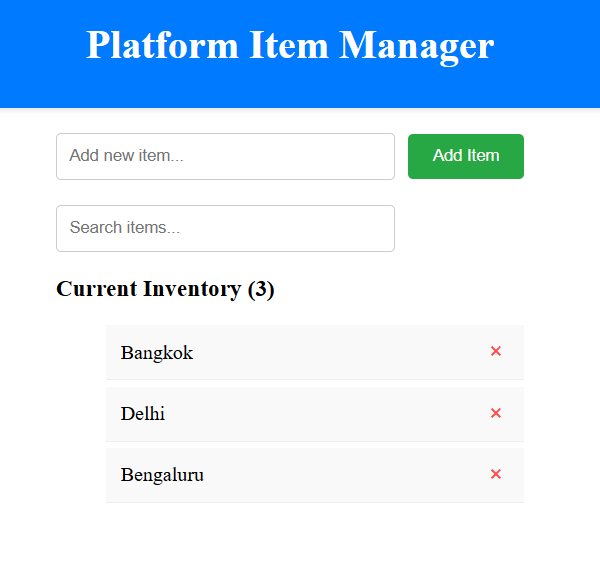
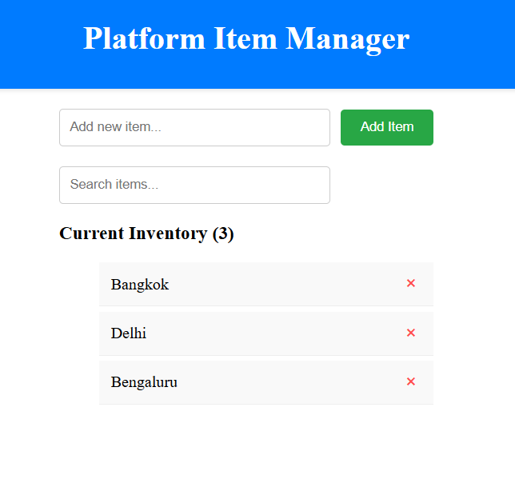

# Item List Manager: Platform Edition

A high-performance, accessible, and persistent React application designed to demonstrate industrial-grade frontend architecture. This project showcases the transition from basic feature implementation to a scalable, "Secure by Default" platform standard.

## Design Discussion

The architecture of this application is governed by three core principles: **Separation of Concerns**, **Performance Resilience**, and **Systemic Integrity**.

### 1. Logic vs. UI (The Custom Hook Pattern)
Instead of co-locating business logic within the view layer, the application utilizes a centralized `useItemList` hook.
* **Why:** This creates a "headless" logic layer. It allows the core state management (adding, deleting, persistence) to be tested independently of the DOM and reused across different UI representations (e.g., mobile vs. desktop views).

### 2. Performance & The Main Thread
To ensure a **60fps** user experience even with large datasets, we implemented:
* **Memoization:** Individual `ListItem` components are wrapped in `React.memo` to prevent unnecessary re-renders when the parent input field changes.
* **Stable Callbacks:** Using `useCallback` for event handlers ensures that function references remain consistent, preventing the invalidation of memoized child components.
* **Derived State:** Search filtering is calculated on-the-fly during the render cycle using `useMemo`, avoiding the "Sync Hell" of managing a second, redundant state array.

### 3. Reliability & Persistence
* **Deterministic Keys:** We use `crypto.randomUUID()` instead of array indices to ensure React's reconciliation engine accurately tracks item identity during deletions and filtering.
* **Persistence Layer:** The state is automatically hydrated from and persisted to `localStorage`, treating the browser as a resilient distributed node.

---

## Setup Steps

Follow these steps to replicate the development environment locally.

1. **Clone the Repository:**
   ```bash
   git clone [your-repo-link]
   cd item-manager
   ```

2. **Install Dependencies:**
   This project uses **Vite** for optimized bundling and **Vitest** for a high-speed test runner.
   ```bash
   npm install
   ```

3. **Launch Development Server:**
   ```bash
   npm run dev
   ```
   *Access the app at `http://localhost:5173`.*

4. **Run the Test Suite:**
   ```bash
   npx vitest
   ```

---

## Verification & Scenarios

### 1. Empty State & Initial Load
On the first visit, the system should present a clean interface with no items and an empty search bar.


### 2. Adding Items & Validation
Verify that valid strings are added, while empty strings or whitespace-only entries are systemically rejected.
* **Action:** Type "Agoda Stay" and click Add.
* **Expected:** Item appears in the list; input is cleared.


### 3. Real-time Search Filtering
The list should dynamically filter based on the `searchQuery` without losing the original data.
* **Action:** Add "Bangkok", "Delhi", and "Bengaluru". Search for "Ben".
* **Expected:** Only "Bengaluru" is visible.


### 4. Deletion & Performance
Removing an item should be instantaneous and should not trigger re-renders of adjacent items.
* **Action:** Click the "×" button on a list item.
* **Expected:** Item is removed from the DOM and `localStorage`.


### 5. Session Persistence
* **Action:** Add items and refresh the browser tab.
* **Expected:** All items remain visible, hydrated from `localStorage`.


---

## Technical Stack
* **Framework:** React 18
* **Build Tool:** Vite (ESM-based HMR)
* **Testing:** Vitest + React Testing Library + jest-dom
* **State Management:** Custom Hooks + LocalStorage API
* **Styling:** CSS3 (Flexbox/Layout Isolation)

